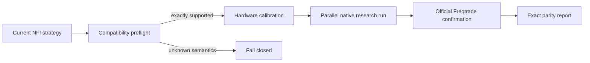

# NFI Backtest Engine

**Backtest years of NFI in minutes. Prove the result against Freqtrade.**

[](https://github.com/vntrevx/NFI_BackTestEngine/releases/latest)
[](https://github.com/vntrevx/NFI_BackTestEngine/actions/workflows/ci.yml)
[](pyproject.toml)
[](LICENSE)

NFI Backtest Engine is a native Rust/Python research backtester for
[NostalgiaForInfinity](https://github.com/iterativv/NostalgiaForInfinity) strategies.
It reads the strategy file you supply today, calibrates itself to the current computer,
runs the supported workload in parallel, and compares finalists with official
Freqtrade at zero tolerance.

It does not silently approximate unknown behavior. If an NFI update introduces
semantics that cannot be lowered exactly, the run stops with a clear compatibility
result before consuming days of compute.

> **v1.0.0 is Full X7 release-certified.** The release includes the candidate wheels,
> checksums, machine-readable certificate, and evidence bundle. Official Freqtrade
> remains the final oracle for deployment-sensitive validation.

## The result

The v1.0.0 certificate uses X7 v17.4.421 at upstream commit
`5e168431991e05a889514eb1e16fdbebc6a09811`.

| Evidence | Certified result |
| --- | ---: |
| Scope | 80 spot pairs · 5 timeframes · `20210101-20260101` |
| Official Freqtrade 2026.5.1 | 61 h 34 m · one continuous run |
| NFI Backtest Engine | 26 m 24 s median · 5 measured runs |
| Observed speedup | **139.927×** |
| Time reduction | **99.285%** |
| Native peak RSS | 13.41 GiB |
| Exact surface | 927 trades · 11,783 orders · zero tolerance |
| Branch-reaching proof | 7/7 full-state fixtures passed |

These numbers were measured on the same Windows release host with 6 physical / 12
logical CPU cores and 32 GiB RAM. Performance varies by hardware and workload; parity
does not.

Release evidence:

- [v1.0.0 release](https://github.com/vntrevx/NFI_BackTestEngine/releases/tag/v1.0.0)
- [Full X7 certificate](https://github.com/vntrevx/NFI_BackTestEngine/releases/download/v1.0.0/full-x7-certification-windows-x86_64.json)
- [Certification evidence bundle](https://github.com/vntrevx/NFI_BackTestEngine/releases/download/v1.0.0/full-x7-certification-evidence.zip)
- [SHA-256 checksums](https://github.com/vntrevx/NFI_BackTestEngine/releases/download/v1.0.0/SHA256SUMS.txt)

## How it works



The native lane is built for fast iteration. The official lane is deliberately
independent and slower: it proves that the chosen candidate still means the same thing
to Freqtrade.

## Install

### One command

Windows PowerShell:

```powershell
irm https://raw.githubusercontent.com/vntrevx/NFI_BackTestEngine/main/install.ps1 | iex
```

Linux x86_64/aarch64 or macOS Apple Silicon:

```bash
curl -LsSf https://raw.githubusercontent.com/vntrevx/NFI_BackTestEngine/main/install.sh | sh
```

The installer:

1. detects the operating system and CPU architecture;
2. downloads the matching wheel from the latest GitHub release;
3. verifies its published SHA-256 digest;
4. installs `nfi-bte` into an isolated `uv tool` environment.

It installs `uv` through Astral's official installer only when `uv` is missing.

Verify the installation:

```powershell
nfi-bte --version
nfi-bte doctor
```

Expected version:

```text
nfi-bte 1.0.0
```

### Inspect before running

Windows:

```powershell
irm https://raw.githubusercontent.com/vntrevx/NFI_BackTestEngine/main/install.ps1 `
  -OutFile install.ps1
Get-Content .\install.ps1
.\install.ps1
```

Linux or macOS:

```bash
curl -LsSf https://raw.githubusercontent.com/vntrevx/NFI_BackTestEngine/main/install.sh \
  -o install.sh
less install.sh
sh install.sh
```

### Manual wheel installation

Download the wheel for your platform from the
[latest release](https://github.com/vntrevx/NFI_BackTestEngine/releases/latest), verify
it against `SHA256SUMS.txt`, then install it:

```powershell
uv tool install --python 3.12 path\to\nfi_backtest_engine-*.whl
```

GitHub Releases is the supported distribution channel. PyPI, npm, and bun are not
required for this Python/Rust native application.

## Run your first five-year backtest

Pass the strategy file:

```powershell
nfi-bte run path\to\NostalgiaForInfinityX7.py
```

The first-run wizard automatically:

- finds the strategy class;
- detects `user_data/config.json`;
- detects the Freqtrade candle directory;
- reads the effective pair whitelist;
- proposes the previous five complete calendar years;
- inspects CPU affinity, available memory, and Docker limits;
- calibrates worker memory with a real full-range pair;
- saves the reusable project to `.nfi/project.json`.

Only values that cannot be discovered safely are requested. Accept every unambiguous
choice and the five-year default without prompts:

```powershell
nfi-bte run path\to\NostalgiaForInfinityX7.py --yes
```

After setup:

```powershell
nfi-bte run
```

Interrupted runs resume only hash-valid data and vector stages. Changed strategy,
config, candle, market, dependency, or hardware identities invalidate the affected
checkpoint instead of being silently reused.

### Explicit paths

```powershell
nfi-bte run path\to\NostalgiaForInfinityX7.py `
  --class NostalgiaForInfinityX7 `
  --config user_data\config.json `
  --datadir user_data\data\binance `
  --timerange 20210101-20260101 `
  --output-dir artifacts\x7-2021-2025 `
  --yes
```

Missing candle coverage is filled through the pinned Freqtrade container by default.
Use `--no-download` for an offline, fail-if-missing run.

### Prepare now, simulate later

```powershell
nfi-bte run path\to\NostalgiaForInfinityX7.py --prepare-only
nfi-bte run
```

To save configuration without starting:

```powershell
nfi-bte init path\to\NostalgiaForInfinityX7.py
```

## Confirm with official Freqtrade

Run the pinned official reference from a completed research directory:

```powershell
nfi-bte reference research artifacts\x7-2021-2025 `
  --output-dir artifacts\x7-2021-2025-official
```

Or compare an existing plain JSON or zipped Freqtrade export:

```powershell
nfi-bte confirm `
  artifacts\x7-2021-2025 `
  path\to\backtest-result.zip `
  --strategy NostalgiaForInfinityX7 `
  --output-dir artifacts\x7-2021-2025-confirmation
```

The comparator normalizes both surfaces and stops at the first exact semantic
difference. There is no floating-point tolerance.

The official reference lane:

- materializes the sealed strategy and sanitized effective config;
- verifies every input hash before execution;
- captures or reuses frozen public market metadata;
- runs the pinned Freqtrade image offline;
- stores analyzed frames in a bounded Arrow spool by default;
- removes only containers owned by this project.

It never concatenates independent timerange chunks into one claimed result. Chunk
boundaries reset wallet, open-trade, protection, and strategy state.

## Safe performance by default

The engine does not guess that every machine can run the same worker count.

- CPU processes are capped by physical, logical, and affinity-visible cores.
- One real worst-footprint pair measures the workload's full-range peak.
- Current free memory and an explicit user cap determine worker admission.
- NumPy, Polars, Rayon, OpenMP, OpenBLAS, and MKL nesting are limited inside workers.
- Shared wallet, slot, order, trade, protection, and pair-lock state stays
  chronological and deterministic in Rust.
- Managed Docker workloads run sequentially and respect the daemon's separate memory
  boundary.
- Large native vectors and official analyzed frames use bounded disk-backed spools.

Inspect the current machine without changing it:

```powershell
nfi-bte doctor --output .nfi\doctor.json
nfi-bte system tune --output .nfi\execution-profile.json
nfi-bte system show .nfi\execution-profile.json
nfi-bte system docker
```

Recalibrate after an intentional hardware, dependency, or data change:

```powershell
nfi-bte run --recalibrate
```

## Results you can audit

Every run is a directory of ordinary, hash-linked files:

| Path | Purpose |
| --- | --- |
| `run.json` | Final status, run identity, stage timings, and evidence links |
| `execution-profile.json` | Observed CPU limits and explicit memory cap |
| `engine-profile.json` | Decode, validation, event-loop, and serialization timings |
| `strategy-analysis.json` | Compiled capability boundary and blockers |
| `hot-callback-ir.json` | Lowered hot callback behavior |
| `data-seal.json` | Candle coverage, file sizes, and SHA-256 identities |
| `simulation-result.json` | Deterministic native result |
| `trade-surface.json` | Normalized exact-parity surface |
| `checkpoints/` | Hash-validated resumable stages |

Run outcomes are intentionally small:

| Status | Meaning |
| --- | --- |
| `prepared` | Immutable data and vectors are ready |
| `complete` | The supported contract produced a deterministic result |
| `blocked_unsupported_semantics` | Active behavior has no exact lowering |

The blocked status is a safety verdict, not a crash.

## Daily NFI updates

The engine compiles the supplied source instead of selecting a hard-coded whole-file
revision. Check a new NFI file before preparing years of data:

```powershell
nfi-bte strategy check `
  path\to\NostalgiaForInfinityX7.py `
  --class NostalgiaForInfinityX7 `
  --trading-mode spot `
  --output artifacts\x7-compatibility.json
```

A structurally supported update passes immediately. A new stateful contract returns
`EXACT_LOWERING_REVIEW_REQUIRED`.

The v1.0.0 branch-reaching matrix proves:

- a real tag-121 adjustment and legacy-grind path;
- `CooldownPeriod`, `StoplossGuard`, `MaxDrawdown`, and `LowProfitPairs`;
- deterministic pair locks;
- compound tag `141 142`;
- tag-dependent leverage values 2 and 3;
- an actual isolated-futures liquidation exit.

This evidence is bound to the sealed v17.4.421 source and inputs. A changed strategy
must pass compatibility again and requires a new official confirmation before its
results inherit an exactness claim.

See the full [X7 support boundary](docs/x7-support.md).

## Useful commands

| Command | Use |
| --- | --- |
| `nfi-bte run` | Run or resume the saved research project |
| `nfi-bte strategy check ...` | Preflight a newly downloaded NFI revision |
| `nfi-bte system tune` | Inspect hardware and create an execution profile |
| `nfi-bte reference research ...` | Run the official Freqtrade oracle |
| `nfi-bte confirm ...` | Compare an existing Freqtrade export |
| `nfi-bte batch ...` | Run independent candidates within resource limits |
| `nfi-bte runs list` | Inspect the durable run index |
| `nfi-bte performance ...` | Repeat a same-fixture parity and resource gate |
| `nfi-bte certify ...` | Create a release-grade evidence bundle |

Use `nfi-bte COMMAND --help` for the complete contract.

## Verify an included exact fixture

This smoke test requires a source checkout because the captured fixture lives in the
repository:

```powershell
nfi-bte engine fixture `
  benchmarks\fixtures\captured\normal-routing-spot-2025-01-01_04\manifest.json `
  --output-dir artifacts\fixture-smoke `
  --level full
```

Expected:

```text
engine fixture parity (full): trades=True, state=True
```

`quick` compares the final normalized trade surface. `full` also compares shared
portfolio state after every Freqtrade-visible candle.

## Platform support

| Platform | Native engine | Official reference |
| --- | --- | --- |
| Windows x64 | Native wheel | Docker Desktop |
| Linux x86_64 | Native wheel | Docker Engine |
| Linux aarch64 | Native wheel | Docker Engine |
| macOS Apple Silicon | Native arm64 wheel | Docker Desktop |

The official fixtures retain their captured `linux/amd64` Freqtrade platform. Docker
Desktop may emulate that image on Apple Silicon; the tool never swaps reference
platforms without new parity evidence.

Requirements:

- Python 3.12, 3.13, or 3.14;
- an NFI/Freqtrade strategy, config, candle directory, and timerange;
- Docker only for missing-data downloads or official Freqtrade confirmation.

Public market metadata needs no exchange API credentials. Never commit private keys or
live-trading secrets.

## Build from source

```powershell
git clone https://github.com/vntrevx/NFI_BackTestEngine.git
cd NFI_BackTestEngine
uv sync --extra dev --frozen
uv run maturin develop --release --locked
uv run nfi-bte --version
```

Development checks:

```powershell
uv lock --check
uv run ruff check .
uv run basedpyright --level error python/nfi_backtest_engine
uv run pytest -q
cd rust
cargo fmt --all -- --check
cargo test --workspace --locked
cargo clippy --workspace --all-targets --locked -- -D warnings
```

## Repository map

```text
python/nfi_backtest_engine/   CLI, orchestration, strategy IR, parity, reports
rust/crates/nfi-sim-core/     deterministic chronological portfolio simulator
rust/crates/nfi-vector-io/    SHA-verified projected Feather reader
benchmarks/fixtures/          synthetic and captured Freqtrade contracts
benchmarks/evidence/          bounded, hash-sealed historical evidence
tests/                        unit, integration, surface, and state-parity tests
docs/                         architecture, support, and release contracts
install.ps1 / install.sh      verified one-command installers
```

Generated profiles, caches, run registries, build outputs, and user runs belong in
`.nfi/`, `dist/`, or `artifacts/`; those paths are ignored by Git.

## Documentation

- [Product contract and long-horizon goal](PROJECT_BRIEF.md)
- [Architecture and semantic ownership](docs/architecture.md)
- [X7 support and exact certificates](docs/x7-support.md)
- [Benchmark fixture specification](benchmarks/README.md)
- [Release boundary and publishing](docs/release.md)
- [Contributing](CONTRIBUTING.md)
- [Security policy](SECURITY.md)

## Project boundary

NFI Backtest Engine is a research accelerator, not a live trading bot and not a promise
of profitability. It makes large strategy experiments fast, reproducible, and
inspectable. Official Freqtrade remains the final authority before a result is used for
deployment.

MIT licensed.
